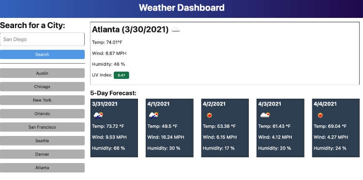

# ☁ ☀ ☂ 💧 ☔ ℃ ⛅  Weather Dashboard

## How does it work?

```
Search for a City
THEN you will be presented with current and future conditions for that city and that city is added to the search history!.
WHEN you view current weather conditions for that city
THEN you will be presented with the following information:
- City name, the date, an icon representation of weather conditions, the temperature, the humidity, the wind speed, and the UV index ans mentioned before.
NOTE the UV index will be presented with a color that indicates whether the conditions are favorable, moderate, or severe.
If you view future weather conditions for that city
youwill be presented with a 5-day forecast that displays the date, an icon representation of weather conditions, the temperature, the wind speed, and the humidity
WHEN you click on a city in the search history
THEN you will again be presented with current and future conditions for that city!!
```
## Appeareance

The following image shows the web application's appearance and functionality:




---
© 2022 Confidential and Proprietary. All Rights Reserved.